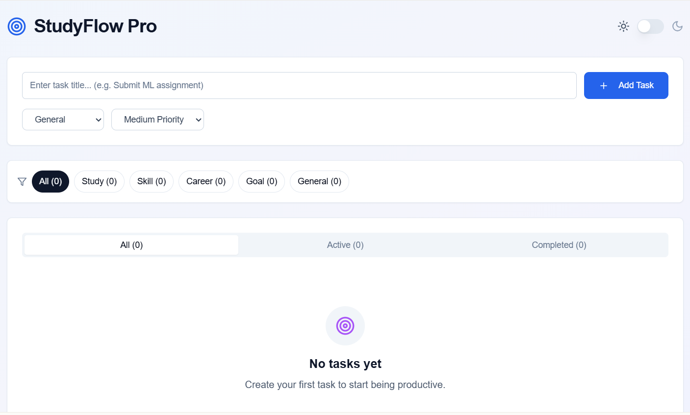

# ✨ Taskmate — Your Academic Adventure Tracker 🚀

# 🎯 StudyFlow Pro

**StudyFlow Pro** is a modern task management tool tailored for students and young professionals who aim to organize their study goals, skills, career objectives, and personal growth efficiently — all in one place with a clean, intuitive UI.



---

## ✨ Features

- 🧼 **Minimalist UI** with light/dark mode support
- 🔍 **Category Filters**: Study, Skill, Career, Goal, General
- 📌 **Priority Levels**: High, Medium, Low
- 📊 **Status Filters**: All | Active | Completed
- ➕ **Quick Add Task** with dropdown classification
- ⚙️ Smooth performance and responsive layout
- 🔄 Easy task categorization and tracking

---

## 🚀 Perfect For

- Students managing deadlines and academic tasks
- Learners tracking new skills
- Professionals managing goals and career plans
- Productivity lovers who prefer a clutter-free interface

---

## 🛠 Tech Stack

- HTML, CSS, JavaScript (Vanilla or Framework)
- Responsive design best practices
- Designed with [Lovable.dev](https://lovable.dev/) UI components

---

## 🧪 Upcoming Features (In Progress)

> We're just getting started! Here’s what’s planned:

- ⏰ Reminders & Notifications
- 🗓️ Calendar View Integration
- 📈 Productivity Charts
- 🎯 Task Recommendations (AI-based)
- 🌐 Sync with Google Tasks / Calendar

---


## 📂 Getting Started

```bash
git clone https://github.com/donthireddysaivarshini/Taskmate.git
cd Taskmate
# Open in browser or your favorite editor

---

## 🛠 Built With

- Lovable (for design and code generation)
- GitHub for version control and collaboration

---

## 🧠 Future Plans

- ⏰ Reminders & Notifications  
- 📅 Calendar integration  
- 🧩 Skill Tracker mode (for coding, design, etc.)  
- 📈 Productivity insights & stats

---

## 🧑‍💻 Contributing

Want to contribute your ideas or help enhance the app?  
Pull requests and suggestions are welcome! 💡

---

## 📄 License

This project is open-source and available under the [MIT License](LICENSE).
